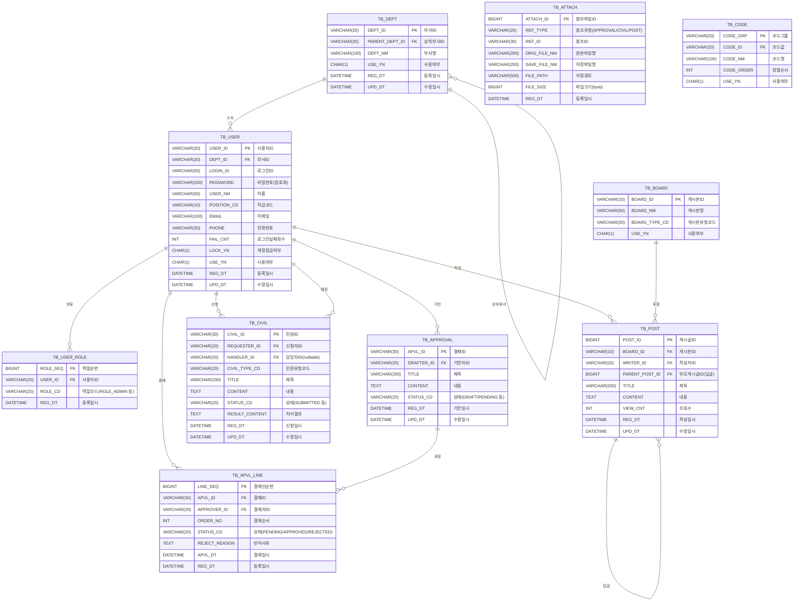

# ERD 설계서

| 항목 | 내용 |
|------|------|
| 프로젝트명 | ○○시청 행정 내부 업무 관리 시스템 (AMS) |
| 문서 버전 | v1.0 |
| 작성일 | 2026-04-30 |
| 작성자 | 박유한 |

---

## 1. 엔티티 목록

| 테이블명 | 한글명 | 설명 |
|----------|--------|------|
| TB_DEPT | 부서 | 조직 부서 정보 |
| TB_USER | 사용자 | 직원 계정 정보 |
| TB_USER_ROLE | 사용자 역할 | 사용자-역할 매핑 |
| TB_APPROVAL | 전자결재 | 기안서 정보 |
| TB_APVL_LINE | 결재선 | 기안서별 결재자 순서 |
| TB_CIVIL | 민원 | 민원 신청 정보 |
| TB_BOARD | 게시판 | 게시판 마스터 |
| TB_POST | 게시글 | 게시판 게시글 |
| TB_ATTACH | 첨부파일 | 공통 첨부파일 (결재/민원/게시글) |
| TB_CODE | 공통코드 | 상태값 등 코드 관리 |

---

## 2. ERD 다이어그램 (Mermaid)

---

## 3. 테이블 상세 정의

### TB_DEPT (부서)

| 컬럼명 | 타입 | NULL | 기본값 | 설명 |
|--------|------|------|--------|------|
| DEPT_ID | VARCHAR(20) | NOT NULL | | PK, 부서ID |
| PARENT_DEPT_ID | VARCHAR(20) | NULL | | FK(자기참조), 상위부서 |
| DEPT_NM | VARCHAR(100) | NOT NULL | | 부서명 |
| USE_YN | CHAR(1) | NOT NULL | 'Y' | 사용여부 |
| REG_DT | DATETIME | NOT NULL | NOW() | 등록일시 |
| UPD_DT | DATETIME | NULL | | 수정일시 |

---

### TB_USER (사용자)

| 컬럼명 | 타입 | NULL | 기본값 | 설명 |
|--------|------|------|--------|------|
| USER_ID | VARCHAR(20) | NOT NULL | | PK |
| DEPT_ID | VARCHAR(20) | NOT NULL | | FK → TB_DEPT |
| LOGIN_ID | VARCHAR(50) | NOT NULL | | 로그인ID (UNIQUE) |
| PASSWORD | VARCHAR(200) | NOT NULL | | 암호화 비밀번호 |
| USER_NM | VARCHAR(50) | NOT NULL | | 이름 |
| POSITION_CD | VARCHAR(10) | NOT NULL | | 직급코드 (TB_CODE 참조) |
| EMAIL | VARCHAR(100) | NULL | | 이메일 |
| PHONE | VARCHAR(20) | NULL | | 전화번호 |
| FAIL_CNT | INT | NOT NULL | 0 | 로그인 실패 횟수 |
| LOCK_YN | CHAR(1) | NOT NULL | 'N' | 계정 잠금 여부 |
| USE_YN | CHAR(1) | NOT NULL | 'Y' | 사용여부 |
| REG_DT | DATETIME | NOT NULL | NOW() | 등록일시 |
| UPD_DT | DATETIME | NULL | | 수정일시 |

---

### TB_USER_ROLE (사용자 역할)

| 컬럼명 | 타입 | NULL | 기본값 | 설명 |
|--------|------|------|--------|------|
| ROLE_SEQ | BIGINT | NOT NULL | AUTO_INCREMENT | PK |
| USER_ID | VARCHAR(20) | NOT NULL | | FK → TB_USER |
| ROLE_CD | VARCHAR(20) | NOT NULL | | ROLE_ADMIN / ROLE_APPROVER / ROLE_HANDLER / ROLE_USER |
| REG_DT | DATETIME | NOT NULL | NOW() | 등록일시 |

---

### TB_APPROVAL (전자결재)

| 컬럼명 | 타입 | NULL | 기본값 | 설명 |
|--------|------|------|--------|------|
| APVL_ID | VARCHAR(30) | NOT NULL | | PK (예: APVL-20260430-001) |
| DRAFTER_ID | VARCHAR(20) | NOT NULL | | FK → TB_USER (기안자) |
| TITLE | VARCHAR(200) | NOT NULL | | 제목 |
| CONTENT | TEXT | NOT NULL | | 내용 |
| STATUS_CD | VARCHAR(20) | NOT NULL | 'DRAFT' | 상태코드 |
| REG_DT | DATETIME | NOT NULL | NOW() | 기안일시 |
| UPD_DT | DATETIME | NULL | | 수정일시 |

---

### TB_APVL_LINE (결재선)

| 컬럼명 | 타입 | NULL | 기본값 | 설명 |
|--------|------|------|--------|------|
| LINE_SEQ | BIGINT | NOT NULL | AUTO_INCREMENT | PK |
| APVL_ID | VARCHAR(30) | NOT NULL | | FK → TB_APPROVAL |
| APPROVER_ID | VARCHAR(20) | NOT NULL | | FK → TB_USER (결재자) |
| ORDER_NO | INT | NOT NULL | | 결재 순서 (1, 2, 3) |
| STATUS_CD | VARCHAR(20) | NOT NULL | 'PENDING' | 결재 상태 |
| REJECT_REASON | TEXT | NULL | | 반려 사유 |
| APVL_DT | DATETIME | NULL | | 결재 처리 일시 |
| REG_DT | DATETIME | NOT NULL | NOW() | 등록일시 |

---

### TB_CIVIL (민원)

| 컬럼명 | 타입 | NULL | 기본값 | 설명 |
|--------|------|------|--------|------|
| CIVIL_ID | VARCHAR(30) | NOT NULL | | PK (예: CIVIL-20260430-001) |
| REQUESTER_ID | VARCHAR(20) | NOT NULL | | FK → TB_USER (신청자) |
| HANDLER_ID | VARCHAR(20) | NULL | | FK → TB_USER (담당자) |
| CIVIL_TYPE_CD | VARCHAR(20) | NOT NULL | | 민원유형코드 (TB_CODE 참조) |
| TITLE | VARCHAR(200) | NOT NULL | | 제목 |
| CONTENT | TEXT | NOT NULL | | 내용 |
| STATUS_CD | VARCHAR(20) | NOT NULL | 'SUBMITTED' | 처리 상태 |
| RESULT_CONTENT | TEXT | NULL | | 처리 결과 내용 |
| REG_DT | DATETIME | NOT NULL | NOW() | 신청일시 |
| UPD_DT | DATETIME | NULL | | 수정일시 |

---

### TB_BOARD (게시판)

| 컬럼명 | 타입 | NULL | 기본값 | 설명 |
|--------|------|------|--------|------|
| BOARD_ID | VARCHAR(10) | NOT NULL | | PK (예: NOTICE, ARCHIVE, QNA) |
| BOARD_NM | VARCHAR(50) | NOT NULL | | 게시판명 |
| BOARD_TYPE_CD | VARCHAR(20) | NOT NULL | | 게시판유형코드 |
| USE_YN | CHAR(1) | NOT NULL | 'Y' | 사용여부 |

---

### TB_POST (게시글)

| 컬럼명 | 타입 | NULL | 기본값 | 설명 |
|--------|------|------|--------|------|
| POST_ID | BIGINT | NOT NULL | AUTO_INCREMENT | PK |
| BOARD_ID | VARCHAR(10) | NOT NULL | | FK → TB_BOARD |
| WRITER_ID | VARCHAR(20) | NOT NULL | | FK → TB_USER |
| PARENT_POST_ID | BIGINT | NULL | | FK(자기참조), Q&A 답글 |
| TITLE | VARCHAR(200) | NOT NULL | | 제목 |
| CONTENT | TEXT | NOT NULL | | 내용 |
| VIEW_CNT | INT | NOT NULL | 0 | 조회수 |
| REG_DT | DATETIME | NOT NULL | NOW() | 작성일시 |
| UPD_DT | DATETIME | NULL | | 수정일시 |

---

### TB_ATTACH (첨부파일)

| 컬럼명 | 타입 | NULL | 기본값 | 설명 |
|--------|------|------|--------|------|
| ATTACH_ID | BIGINT | NOT NULL | AUTO_INCREMENT | PK |
| REF_TYPE | VARCHAR(20) | NOT NULL | | 참조유형 (APPROVAL / CIVIL / POST) |
| REF_ID | VARCHAR(30) | NOT NULL | | 참조 레코드 ID |
| ORIG_FILE_NM | VARCHAR(200) | NOT NULL | | 원본 파일명 |
| SAVE_FILE_NM | VARCHAR(200) | NOT NULL | | UUID 저장 파일명 |
| FILE_PATH | VARCHAR(500) | NOT NULL | | 서버 저장 경로 |
| FILE_SIZE | BIGINT | NOT NULL | | 파일 크기 (byte) |
| REG_DT | DATETIME | NOT NULL | NOW() | 등록일시 |

---

### TB_CODE (공통코드)

| 컬럼명 | 타입 | NULL | 기본값 | 설명 |
|--------|------|------|--------|------|
| CODE_GRP | VARCHAR(20) | NOT NULL | | PK1, 코드 그룹 |
| CODE_ID | VARCHAR(20) | NOT NULL | | PK2, 코드 값 |
| CODE_NM | VARCHAR(100) | NOT NULL | | 코드 명칭 |
| CODE_ORDER | INT | NOT NULL | 0 | 정렬 순서 |
| USE_YN | CHAR(1) | NOT NULL | 'Y' | 사용여부 |

---

## 4. 공통코드 초기 데이터

| CODE_GRP | CODE_ID | CODE_NM |
|----------|---------|---------|
| POSITION | P01 | 사원 |
| POSITION | P02 | 주임 |
| POSITION | P03 | 대리 |
| POSITION | P04 | 과장 |
| POSITION | P05 | 차장 |
| POSITION | P06 | 부장 |
| APVL_STATUS | DRAFT | 임시저장 |
| APVL_STATUS | PENDING | 결재 대기 |
| APVL_STATUS | IN_PROGRESS | 결재 중 |
| APVL_STATUS | APPROVED | 최종 승인 |
| APVL_STATUS | REJECTED | 반려 |
| APVL_STATUS | CANCELED | 취소 |
| CIVIL_STATUS | SUBMITTED | 신청 |
| CIVIL_STATUS | RECEIVED | 접수 |
| CIVIL_STATUS | ASSIGNED | 배정 완료 |
| CIVIL_STATUS | IN_PROGRESS | 처리 중 |
| CIVIL_STATUS | COMPLETED | 처리 완료 |
| CIVIL_STATUS | REJECTED | 반려 |
| CIVIL_TYPE | GEN | 일반 민원 |
| CIVIL_TYPE | INFO | 정보 공개 |
| CIVIL_TYPE | COMPLAINT | 불만/건의 |
| ROLE | ROLE_ADMIN | 시스템 관리자 |
| ROLE | ROLE_APPROVER | 결재자 |
| ROLE | ROLE_HANDLER | 담당자 |
| ROLE | ROLE_USER | 일반 사용자 |

---

## 5. 관계 요약

| 관계 | 카디널리티 | 설명 |
|------|-----------|------|
| TB_DEPT → TB_DEPT | 0..1 : N | 부서 계층 (자기참조) |
| TB_DEPT → TB_USER | 1 : N | 한 부서에 여러 직원 |
| TB_USER → TB_USER_ROLE | 1 : N | 한 사용자에 여러 역할 |
| TB_USER → TB_APPROVAL | 1 : N | 한 사용자가 여러 기안 |
| TB_APPROVAL → TB_APVL_LINE | 1 : N | 한 기안서에 최대 3개 결재선 |
| TB_USER → TB_APVL_LINE | 1 : N | 한 사용자가 여러 결재 처리 |
| TB_USER → TB_CIVIL (신청자) | 1 : N | 한 사용자가 여러 민원 신청 |
| TB_USER → TB_CIVIL (담당자) | 1 : N | 한 담당자가 여러 민원 처리 |
| TB_BOARD → TB_POST | 1 : N | 한 게시판에 여러 게시글 |
| TB_USER → TB_POST | 1 : N | 한 사용자가 여러 게시글 작성 |
| TB_POST → TB_POST | 0..1 : N | 답글 (자기참조) |
| TB_ATTACH | - | REF_TYPE + REF_ID로 다형적 연관 |
